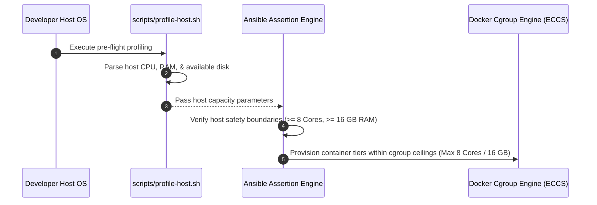

# Target Architecture and Multi-Tier Interface Map

## 1. Multi-Tier Service Sizing Boundaries

Resources fluctuate dynamically within strict maximum limits based on active platform routing traffic managed via Ansible cgroup definitions. Host hardware availability is dynamically discovered via `scripts/profile-host.sh` prior to Ansible orchestration execution[cite: 1].

| Simulated Service Tier         | Engine Mechanism                         | Max vCPU Cap | Max RAM Cap | Network Invariant Scope                             |
| :----------------------------- | :--------------------------------------- | :----------- | :---------- | :-------------------------------------------------- |
| **Computing Fabric (4 Nodes)** | On-Demand Container Clusters             | 6 Cores      | 12 GB       | Managed Kuma Data-Plane Proxy Workspace             |
| **Integrated Ingress Gateway** | Kuma Gateway Mode (Envoy Edge Proxy)     | 1 Core       | 2 GB        | Edge Host Port Bindings & Path Translation Policies |
| **Kuma SDN Control Plane**     | Universal Single-Container Control Plane | 1 Core       | 2 GB        | Centralized Multi-Mesh Virtual VPC Topology         |
| **TOTAL ECOSYSTEM CEILING**    | **Elastic Platform Capacity Profile**    | **8 Cores**  | **16 GB**   | **Ansible-Orchestrated Software-Defined Network**   |

For the granular programmatic layout and block interaction model mapping these boundaries, see [Target System Design Blueprint](03-system-design.md)[cite: 1].

## 2. Dynamic Host Hardware Profiling & Capacity Assertion Pipeline

Before Ansible provisions local platform containers, host capacity is profiled using `scripts/profile-host.sh`[cite: 1]. The values extracted during host profiling determine the dynamic clamping ceilings applied across tiers to guarantee that local workstation performance remains protected[cite: 1].

