# Target System Design: Decoupled Multi-Tier Control Plane Architecture

This document provides the low-level, technical system engineering design for the local cloud platform simulation. It maps out how the configuration manager, template engine, and network virtualization layers interact dynamically inside our hardware cgroup caps.

## 1. Core Component Workflow Architecture

The system segregates orchestration logic into three distinct runtime layers, ensuring that the developer workstation host environment remains fully insulated from vendor tools and runtime execution bugs:

1. **The Orchestration Plane (Ansible)**: Governs state tracking, capacity checks, and container lifecycles.
2. **The Generation Plane (The "Dry" Render Pipeline)**: Processes vendor-agnostic blueprints into transient manifests.
3. **The Data Plane (CNCF Kuma Universal SDN)**: Runs the application workloads inside secure, tagged Envoy mutual TLS (mTLS) spaces.

```mermaid
graph TD
    %% Styling Definitions
    classDef control fill:#2a3a4a,stroke:#3a5a7a,stroke-width:2px,color:#fff;
    classDef pipeline fill:#3b4a2a,stroke:#5b7a3a,stroke-width:2px,color:#fff;
    classDef network fill:#4a2a3b,stroke:#7a3a5b,stroke-width:2px,color:#fff;
    classDef hardware fill:#1a1a1a,stroke:#333,stroke-width:1px,color:#888,stroke-dasharray: 5 5;

    %% Workstation Bounds
    subgraph HostWorkstationWorkspace ["Host Workstation Workspace - Max Limits: 8 vCPUs / 16 GB RAM Ceiling"]
        %% Ansible Orchestration Node
        A[Developer Runbook Entrypoint<br/>'ansible-playbook'] -->|1. Pre-Flight Audit| B(Ansible Assertion Engine)
        class A,B control;

        %% Manifest Generation Loop
        B -->|2. Invoke Compilation| C{render-manifests.sh}
        subgraph GenerationLayer [The Dry Render Engine]
            C -->|Reads Blueprint| D[blueprints/platform-services.json]
            C -->|Compiles YAML| E[docs/compiled-manifests/dataplanes/]
        end
        class C,D,E pipeline;

        %% Container & Infrastructure Provisioning
        B -->|3. Provision Containers| F[community.docker Driver]
        F -->|Launches Nodes| G[Tier 1: Elastic Container Computing Service]
        class F,G control;

        %% Network Routing Overlay
        E -.->|4. Mount Declarations| H[CNCF Kuma Universal SDN Control Plane]
        G -->|Attaches Agents| H

        subgraph SDNFabric [Identity-Based Virtual VPC Mesh]
            H -->|Enforces Identity Rules| I[Tier 2 & 3: Integrated Ingress Gateway]
            H -->|Injects Traffic Mesh| J[Tier 4: Managed Kubernetes Workloads]
            I -->|Secure mTLS Proxy Tunnel| J
        end
        class H,I,J network;
    end
    class HostWorkstationWorkspace hardware;
```

## 2. Dynamic Component Interaction Contract

- **Idempotence Constraint**: The Ansible Engine polls the host environment for active instances before initializing any tasks. If intermediate state configurations exist, they are audited and patched online without restarting neighboring containers.
- **Data Boundary Insulation**: The transient folder `docs/compiled-manifests/` is isolated from direct host networking. Configuration components communicate exclusively through abstract network attributes (`kuma.io/service`, `tier`), rendering hardcoded subnets obsolete.
- **Resource Clamping Mechanic**: Containers are allocated specific vCPU and RAM fractions during step 3 via Docker cgroup runtime bounds. This preserves workstation responsiveness during dense simulation runs.

## 3. Related Mapping Frameworks

- To see the policy values that guide this system layout, view [Architecture Foundations](01-foundations.md).
- To view the exact structural mappings of node types and port configurations, see the [Target Layout Map](02-target-layout.md).
