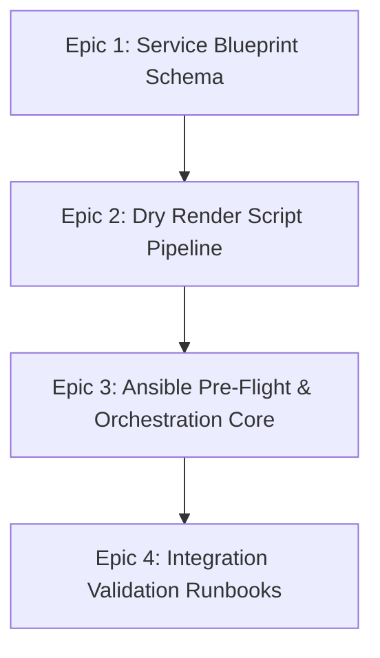

# Milestone 01: Core Blueprint Schema, Render Pipeline & Ansible Orchestration Foundation

- **Status:** Approved / Target for Execution
- **Target File Path:** `docs/milestones/01-foundation-and-dry-render-pipeline.md`
- **Primary Objectives:** Deliver the foundational blueprint configuration schemas, the "Dry" render compilation engine, and the core Ansible pre-flight assertion playbooks.
- **Governance Alignment:** [ADR-0001](../adr/0001-cloud-agnostic-multi-tier-baseline.md)[cite: 2], [ADR-0002](../adr/0002-kuma-universal-sdn-and-dry-render-architecture.md)[cite: 2], [ADR-0004](../adr/0004-standardize-ansible-as-unified-idempotent-orchestration-engine.md)[cite: 2], [Git Workflow](../versioning/git-workflow.md)[cite: 2].

---

## 1. Executive Summary & Epics

Milestone 01 establishes the working baseline code for the decoupled multi-tier platform simulation. It translates the high-level architecture designs in `docs/architecture/` into executable shell, JSON, and Ansible artifacts without introducing vendor lock-in or host-level route collisions.



## 2. Epics & User Stories Breakdown

### Epic 1: Service Blueprint Schema Definition

**Target Branch:** `infra/blueprint-schema-baseline`
**Deliverables:** `blueprints/platform-services.json`

- **Story 1.1**: Define the JSON schema for Tier 1 (ECCS), Tier 2/3 (Ingress/Gateway), and Tier 4 (Kubernetes Workloads).
- **Story 1.2**: Embed Kuma SDN metadata tags (`kuma.io/service`, `tier`, `mesh`) directly into abstract service declarations.
- **Acceptance Criteria**: `jq empty blueprints/platform-services.json` evaluates with zero errors.

### Epic 2: "Dry" Manifest Rendering Pipeline

**Target Branch:** `feature/dry-render-pipeline`
**Deliverables:** `scripts/render-manifests.sh`

- **Story 2.1**: Implement a shell script that ingests `blueprints/platform-services.json` and compiles transient, tagged deployment files into `docs/compiled-manifests/dataplanes/`.
- **Story 2.2**: Ensure directory creation, clean teardown of stale transients, and strict POSIX compliance.
- **Acceptance Criteria**: Executing `scripts/render-manifests.sh` generates valid YAML/JSON data-plane definitions in `docs/compiled-manifests/dataplanes/` without third-party binary tool dependencies.

### Epic 3: Ansible Orchestration & Pre-Flight Capacity Guardrails

**Target Branch:** `infra/ansible-bootstrap-core`
**Deliverables:** `playbooks/requirements.yml`, `playbooks/bootstrap-platform.yml`

- **Story 3.1**: Define `playbooks/requirements.yml` installing the required Ansible collections (`community.docker`).
- **Story 3.2**: Implement `playbooks/bootstrap-platform.yml` with host assertion tasks executing `scripts/profile-host.sh` and asserting that maximum system memory and CPU limits do not exceed 16 GB RAM and 8 vCPUs.
- **Story 3.3**: Configure Ansible task tagging (`render`, `compute`, `networking`, `github-setup`).
- **Acceptance Criteria**: `ansible-playbook playbooks/bootstrap-platform.yml --tags "render"` executes pre-flight assertions and invokes the render pipeline cleanly.

### Epic 4: Validation & Teardown Playbooks

**Target Branch:** `feature/validation-teardown-playbooks`
**Deliverables:** `playbooks/validate-platform.yml`, `playbooks/teardown-platform.yml`

- **Story 4.1**: Create non-destructive validation playbooks verifying local container health and SDN mesh connectivity.
- **Story 4.2**: Create an emergency evacuation playbook (`teardown-platform.yml`) to purge active container boundaries and return workstation resource draw to zero.
- **Acceptance Criteria**: Running `ansible-playbook playbooks/teardown-platform.yml` successfully clears all simulated container instances and transient manifest paths.

## 3. Milestone Execution Sequence & PR Flow

All pull requests must follow the lightweight Gitflow rules defined in `docs/versioning/git-workflow.md`:

```bash
# 1. Start from updated develop branch
git switch develop
git pull --ff-only origin develop

# 2. Create topic branch for Epic 1
git switch -c infra/blueprint-schema-baseline

# 3. Develop, validate, and commit
git add blueprints/platform-services.json
git commit -m "infra: define initial platform services blueprint schema"
git push --set-upstream origin infra/blueprint-schema-baseline

# 4. Open PR to develop using GitHub CLI
gh pr create --base develop --title "infra: define platform services blueprint schema" --body "Delivers Epic 1 for Milestone 01."
gh pr checks
gh pr merge --merge --delete-branch
```

## 4. Definition of Done (DoD) for Milestone 01

1. [ ] `blueprints/platform-services.json` created and validated with `jq`.
2. [ ] `scripts/render-manifests.sh` tested and producing transient output under `docs/compiled-manifests/dataplanes/`[cite: 2].
3. [ ] `playbooks/bootstrap-platform.yml` executing pre-flight resource checks without crashing[cite: 2].
4. [ ] `playbooks/validate-platform.yml` and `playbooks/teardown-platform.yml` created and verified[cite: 2].
5. [ ] All changes merged into `develop` via explicit merge commits (`--merge`) passing all CI status checks.
